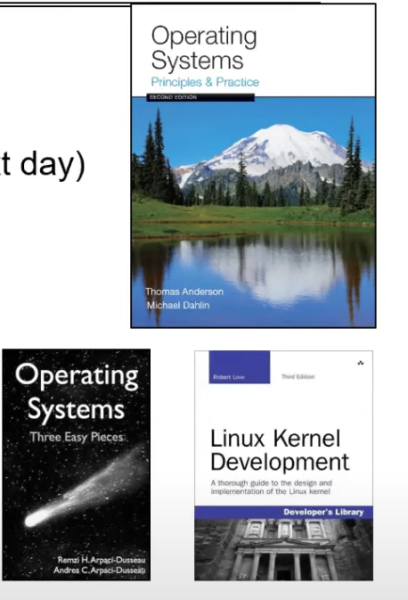
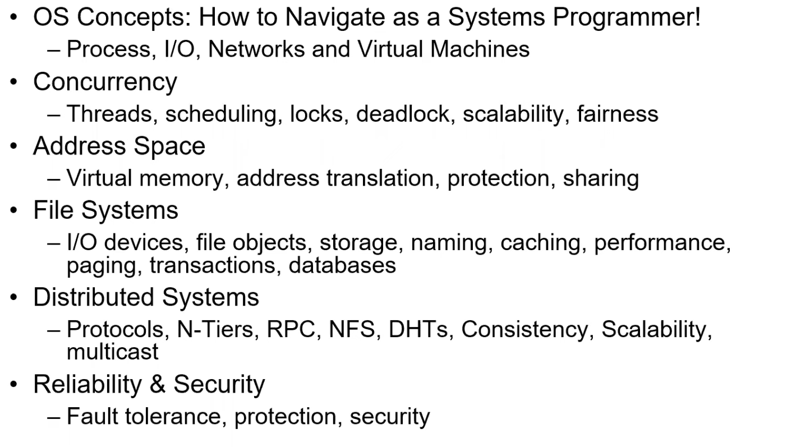

all right welcome everybody to a new term 

we seem to have somehow managed to get 292 people so far on the um on the zoom that's pretty impressive um i'm going to 

uh be 

uh basically lecturing um twice a week from here and hopefully this will work out well feel free i think to avoid the chaos let's have people 

uh type their questions in chat i have two screens so i can kind of watch and 

uh let's just see how this goes if everybody's ready so 

uh 

welcome to the 

uh virtual version of cs162 i guess since we talked about virtualization this is 

uh particularly appropriate um can i get a couple of 

uh thumbs up or something in the chat just to make sure that the sound is good with everybody and please disable your cameras if you could um all right great so my name is john kubatowicz i'll introduce myself a little bit later 

but um today what we're going to do is 

uh we're going to dive right in and kind of ask some questions like what an operating system is since you guys are taking this class in theory and maybe we'll say something about what it's not um we're going to try to give you some ideas of why i find operating systems so exciting and 

uh oh and we'll tell you a little bit about the class but let's dive right in before we get 

uh to the operational parts of the class um and i want to point out that interaction is very important this is going to be kind of hard 

uh even when i teach live normally um the interaction portion of this 

uh is challenging on the first day but once we get into the second day um i think 

uh our second time i think we should be able to ask a lot of questions it'll be great 

so um there's question about whether slides are going to be posted yes we're going to post both the slides and the videos um still getting things um moving forward here 

uh but let's um keep in mind that you're free to ask questions and let's move forward so um first of all let's start with this which is 

uh what i like to call the greatest artifact of human civilization um does anybody recognize what this might be 

do we have any thoughts other than random 

yeah very good we've got several people that basically said internet and in fact there it is so what's a great 

uh about this is that we have billions of people all and and devices all interconnected in one huge system and 

uh lest you think this is a plug for one um 68 or 268 this is 

uh you know the networking is just 

uh one of the amazing aspects of this huge system and the operating systems are really what makes ties it all together and essentially 

uh ties everybody else together which is part of what's very cool about the internet and 

of course you're all off on the internet right now this is all entirely virtual so i guess it's kind of appropriate to start a class this way um and i i had a couple of people comment that this looks like a big brain yes in some sense it does it's got 

uh huge numbers of 

uh connections and interconnectivity and multiple redundancies and so 

the notion of this as a brain is not entirely off base i think what we're going to try to do as the term goes on we're going to try to tame some of the complexity that's hidden inside 

uh both the internet and the devices on it and see how to understand it 

um so you know basically if this were 168 we would probably dwell on slides like this but this is pretty impressive kind of the original arpanet couldn't handle more than 256 devices 

and 

uh now we've got um you know billions four and a half billion devices penetrating maybe sixty percent of the world 

uh which is just astounding 

uh place to come and um you know some of the deadlines here or some of the dates that are particularly interesting in here is i think in the sort of the very early 90s is when the world wide web took off and that was when suddenly the internet became something that lots of people could use and um and turned it into what it is today 

the other thing that's kind of interesting which 

uh is in this this picture as well is this idea of the diversity of devices there are literally this is a graph kind of of um the 

uh sometimes i like to call this colors graph or it's bell's law which is the number of devices 

uh that a person has and if you look originally it was kind of one computer for millions of people back in the original day and then as things moved down now each of you probably has hundreds of devices that are working for you um modern cars have hundreds of processors in them you all have cell phones and laptops and um and little computers inside of devices and thermostats and so on and so this this graph is kind of funny it's almost an inverse moore's law graph where um the number of 

uh computers per person is 

uh increasing as they get smaller which is kind of interesting um and there's a lot of time scales and so when we start talking about how to make this whole system work we're going to have to figure out how to deal with something that's 

uh you know nanoseconds or femtoseconds in some cases up to things that are seconds and and tens of seconds um and somehow the system's got to work across those time scales and that's there's a little magic involved in that and we're going to try to talk about this i did see somebody say femtoseconds no way but a lot of the laser communications 

uh do operate very rapidly um so we'll we'll hold off on the femtoseconds here but sub nanoseconds definitely these days all right now operating systems are really at the heart of all of this basically you make incredible advances continuously in the underlying technology and what happens is somehow each device is a little bit different every technology generation generations a little different and you got to provide 

uh somehow a consistent programming abstraction to applications no matter how complicated the hardware is 

and you gotta manage sharing of resources okay so the more devices we have connected the more resources there are to share and as we get closer to the end of the term so i'm going to say the last third of the term we're going to start talking about some of these 

uh very interesting peer-to-peer systems that are out there that basically allows us to have huge storage systems that span many devices i did see some questions about postings of slides we will definitely um in the future i'll have them up earlier than um the day after lecture 

uh so some of the key building blocks to operating systems are really 

uh things that we're gonna we're gonna learn about in class 

uh processes threads concurrency scheduling coordination many of these things you've learned about in the 61 series address spaces protection isolation sharing security and that level of security is going to be both at the device level and then as we build out into the network you know 

we'll talk about things like ssl and then we'll talk about 

uh more interesting security models as we go and there's going to be communication protocols um there's going to be persistent storage um there's projects i've worked on in the past i'll mention briefly later where it was interested the interesting question was how do you store information for thousands of years without it being destroyed we'll talk about transactions and consistency and resilience and interfaces to all these devices so this is um a class that spans a lot of interesting topics all right and so for instance here's something you do every day without thinking about it multiple times you got your cell phone and you want to look up something 

uh on some device 

uh you know web you know a web page or maybe you're using an app and what happens there well the first thing that happens is 

uh there's a dns request that tries to figure out what the 

uh internet ip address is to where you're trying to go and that goes to a bunch of dns servers 

uh on the network and they return information that helps now your say cell phone route through the internet which is a very interesting 

uh device in and of itself consisting of many pieces um and that may go to a data center somewhere with a load balancer that then will pick one of several possible devices out there which will then maybe do your search and retrieve information from a page store put it back together into some 

uh page that you can use and then you get the result back and you know you do this every day and don't really think about it too much and 

uh once you start thinking about it gets pretty interesting like for instance how is it that those dns servers stay consistent and why is it that it's not possible to hack into them well in fact 

uh back in the middle 2000's people were hacking into them i'll tell you a little bit about that later um and how do you make sure that the packets get enough 

uh priority when they come into an operating system that maybe your your particular query doesn't get delayed a long time so there's some scheduling questions so this is a pretty complex system and it's every time i spend the time to think about it i'm amazed it works okay it's pretty impressive and hopefully by the end of this class you'll have enough knowledge of what's going on in all parts of the operating systems and the networks that you too you know you'll be much smarter than when you started the class of course but um you'll be able to appreciate and sometimes maybe 

uh wonder why it is that it actually manages to work or be impressed that it works so yeah but what's an operating system okay um what does it do we could ask that question um so most likely you could you could say well from the standpoint of what it does this is like being a physicist that's maybe measuring a bunch of things you say well it's memory management it's io management it does scheduling does communication um does multitasking or multi-programming um you could you could ask those things you might ask is an operating system about the file system or about multimedia or about the windowing system or the browser you know back in the 90s there was a lot of fighting between microsoft and bunch of other companies about does the internet browser constitute part of the operating system and you know depending on your point of view that may still not be a resolved question but um anyway it was one that has been asked so um and also i would ask everybody to turn off their video if they could please while they're while we're talking so um so is this you know these questions only interesting to academics it's a question you might ask um okay so 

uh hopefully not hopefully it's interesting to you um could i ask the person just came in turn off your camera please or turn off your video because that will show up in the recording so a definition of an operating system is 

uh no universally accepted definition is part here everything a vendor ships when you order an operating system might be a good approximation 

uh but it varies pretty widely um it might be the one program running at all times on the computer okay 

uh that's the kernel you'll learn a lot about kernels as the term goes on 

uh but you can see these two points of view are are different um you know nobody would disagree that the kernel is 

uh the core of the operating system they would disagree pretty widely about is everything that microsoft ships with a windows product part of the operating system okay probably not all right so you know as we try to to drill down onto what an operating system is you're gonna have to keep in mind that we're gonna talk about things it does and pieces that are important but maybe you'll never fully know what an operating system is um so it's a typically 

uh among other things a special layer of software that provides the application access to hardware resources all right so it's convenient abstractions of complex hardware devices um protected access to shared resources okay security and authentication yeah communication okay 

uh so we could look at something like this where we have some hardware and it's the fact that many applications can simultaneously run on the hardware is something that the os has provided for us okay so yeah that makes sense and you will understand exactly how this works 

uh actually in a few weeks um but maybe we could do it this way well operating system what's the first word operating well that comes actually from 

uh there used to be people like there was a switchboard operator believe it or not when you made a phone call they actually had to plug you in to the right connection and make the wires connect then there were computer operators which were people that basically sat at one of these big machines for a long time and 

uh made sure it was running correctly um and then of course operating systems 

uh the operating part of it then became more about well we're making sure that the disk is operating quickly or the network is operating correctly or the graphics cards are operating correctly all right um what about the word system well this is interesting as well so what makes a system so a system is something with many interrelated parts where typically the sum is much greater than the sum of its parts and 

uh every interrelated part potentially interacts with others and of course that's an n squared 

uh level of complexity at least and we're going to have to come up with apis and 

uh other clever techniques to avoid n squared complexity here because things are complex enough as it is um and making a system which i showed you earlier the internet that's a system that has billions of components to make it robust and not fail is going to require an engineering mindset so you guys are going to have to start thinking like engineers and we're going to give you some tools to really think about how to make something that complicated actually work um again the internet is something which you know it's a great example of a big system that is amazing that it works and it's actually it doesn't always work i i'll pull up some stories later in the term about times where it definitely didn't work my favorite being one time where there was a single optical fiber that divided the network into two pieces and it went through this tunnel in the middle of the country the u.s and a truck went in and blew up and it melted this fiber and it actually temporarily partitioned the network so um there are times when it just doesn't work properly okay so 

uh systems programming is an important part of this class and you're gonna do a lot of it okay you're gonna learn how to take a system like this and figure out exactly how to make it work and that's um that's exciting okay you're going to get some of the tools you're going to learn about git you're going to learn about how to work in groups you're going to learn about testing and all of these things that help to make a complex system actually manageable and hopefully eventually workable okay so so part of making things work are interfaces so here's a 61c view maybe of things the hardware software interface so you have hardware that's these bricks and they got software which might be a program in 61c which hopefully will start coming back to you very rapidly you had a processor and you had memory which had the os in it maybe you had 

uh registers in the processor and those registers pointed at parts of memory okay and that allowed this program to run 

uh maybe you had caches we'll we'll learn about caches again and remember mostly remind you how they work 

uh which help to make the slow memory look fast okay the way i like to think about 

uh a system with caches is you want to make it as fast as the smallest item like the registers and as large as the largest item like the memory or disk and the way you do that is with 

uh caches okay and of course there's page tables and tlbs which will help us out in virtual memory and there's storage disk drives etc there's all sorts of devices like networks and displays and inputs and so making all of this tie together is something you started down the path with 61c hopefully you remember that um and then of course there's interesting things like buses that tie it all together okay and i you know 61c doesn't quite get into that level of detail and we're not going to do that too much i might suggest 152 and 151 some of those interesting classes 

uh if you really want to talk about the maybe 150 if you want to talk about the buses and so on but then of course there's an instruction set architecture which you did talk about and that abstracts away a lot of what's going on in the processor so that people running programs and compilers that are compiling programs have something common to use okay and so what you learned in 61c was machine structures and you also learned c which you're going to get to exploit a lot so i know the notion that in 61c you learn c is maybe a shared with a little bit of skepticism by people but um you're going to get to learn it a lot more in this class so the os abstracts the hardware details from the application so not just the instruction set architecture is going to matter anymore so that abstracts away the computation elements of the processor but we're going to learn how to turn a bunch of storage devices like disks and usb keys and um cloud storage and turn it into a single abstraction like say a file system so that a user can use that easily without having to worry about where the bits are stored okay and so that's where we go with this classes we're going to learn not just about the abstractions from hardware for 61c but ups and processor but abstractions 

uh for other devices as well okay so what is an operating system so let's go through some things it does again let's try to maybe get an idea operationally so one thing that i've started to talk about here is the fact that the operating system is an illusionist in some sense all right it's going to provide clean easy to use abstractions of physical resources and it's going to do so in a way that allow you to at least temporarily think that you've got infinite memory you have a machine entirely dedicated to you or a processor that there are higher level objects like files and users and messages even though as you probably already know but will know very well by the end of the term there aren't files or files are an abstraction of a bunch of individual blocks on a disk that somehow are put together with inodes to give you a file so the operating system is busy providing an illusion of a much more usable machine so that when you program it you have a much easier time of it and you don't have to worry so much about whether it's on disk or on a usb key or in cloud storage okay and we're going to learn also about abstractions of users and messages and we're going to talk about virtualization and how to take the limitations of a system and hide them in a way that makes it easy to program okay 

so for instance so um virtualizing the machine so here's our 61c machine which has a processor it's got memory it's got i o with maybe storage and networks um and on top of it we're going to put this operating system thing which we're learning about as we as we speak and that operating system instead of giving us a processor with 

uh limitations the processor has it's you know it's got a certain um set of registers it's got 

uh certain floating point operations it 

uh has 

uh certain um exceptions that are caused and so on we're going to give an abstraction of something really clean called threads okay um we're going to have address spaces 

uh for instance we're going to learn about rather than a bunch of memory bytes that are in dram and scattered about we're going to provide a nice clean address space abstraction that will 

uh give us the ability to treat the memory as if it's entirely ours even when there's multiple programs running again i just talked about files rather than a bunch of individual blocks we're going to have files and rather than networks which are a bunch of individual ethernet cards let's say that are connected point-to-point between here and beijing we're going to have sockets and routing under the covers okay so that's a pretty clean abstraction which of course ultimately allows me to teach 

uh you guys spread all over the globe as you are okay on top of this these threads address spaces files and sockets are going to be the process abstraction and that process abstraction is going to give us an execution environment with restricted rights provided by the operating system and that process abstraction is going to be a nice virtual machine that your program can run in that's 

uh abstracted away from all of these physical details okay and so on top of that you could have your program so the one thing that you guys get to do a lot more of than you've done so far in your career is you get to actually do 

uh user-level programs running on top of a unix environment okay and so um you're gonna have compiled programs that you have produced that are going to run on top of your process abstraction and in order to give you a clean environment into the process abstraction there'll be system libraries so there's even a system something the c library the security libraries many of the libraries abstract even further and give you nice clean abstractions that maybe allow you to do ssl very easily or so on okay there is an interesting question 

uh in the chat which i'm going to point out some people are asking about closed captioning some classes like last term we even had closed captioning but that's when we need it and we actually have a live captioner in that case unfortunately we don't but what i will do 

uh when i put the um videos up is 

uh they will get automatically closed captioned by 

uh by youtube when i put them on there and so that'll be something but they won't be live sorry about that um so this is our virtualized machine view and the applications machine is the process abstraction provided by the os and some people might argue including the system libraries and each running program runs in its own process and the process gives you a very nice interface nicer than hardware now the question here on the on the chat here is is the hypervisor or docker demon a part of the process acting on as the top layer of the vm so 

uh we will talk a little bit later in the term about docker docker is a way of wrapping up 

uh multiple different little environments and potentially running them inside the process abstraction it's not as 

uh isolated as say a full virtual machine but we'll talk we'll talk more about that in detail let's stick with process abstractions for now um the process abstraction is i'll show you in a second you can have multiple processes all running 

uh at the same time and they're each given isolation from each other so that's what we're going to start with 

uh for this first lecture um so 

uh the system 

uh isa by the way stands for instruction set architecture that was a question so 

uh the system libraries um what does a system programmer think of well the system libraries are linked into your program which is then run by a compiler and turned into bits that will run in the process you're going to get very 

uh good at this as well as you're going to learn how to compile programs link them with libraries and then execute them in a process environment and you'll learn how to invoke the compiler to do that so um this is the programmer's view so what what's in a process so remember the process here is an environment right that gives you threads address spaces file sockets so um a process as i said has an address space which is a chunk of protected memory it has one or more threads in it 

uh one or more threads of control executing in that address space and 

uh the system state associated with open files and sockets and so on and so this is a completely isolated environment we're going to dive into processes very quickly in this class and you're going to learn how we can have a protected address space and multiple threads running in an environment that's protected from other processes even though for instance maybe there's only one core running we're going to give the illusion that there's multiple cores running with multiple processes at the same time so um you've all done this you know here's an example on on say a mac 

uh where you look at the process monitor or the task manager or you do a psa ux on linux box and what you see here which is 

uh perhaps surprising if you haven't really thought about it is that um there are many processes running all the time on your typical laptops okay so many things going simultaneously 50 or 100 of them mostly they're sleeping but they're there to wake up and do some execution at some point okay now the question of why are the middle layers of abstraction necessary so part of the reason that we have many layers of abstraction is that if you try to squash all the layers down which is sometimes done in very specialized environments you end up with an undebugable mess okay and so multiple abstractions assuming they don't make things too slow are a crucial aspect to making things actually work properly okay and so you'll see even modern 

uh operating systems still have several abstraction layers okay and you'll you'll appreciate them i think as we go forward um because it's much easier to actually have an operating system that has a device driver talking to the disk and then you have a file system that provides files and then you have a process abstraction which protects those files and exports them to programming and yes somebody brought up the imagine programming in ones and zeros i can say that i've done that and it's not pleasant but anyway moving moving on here so here's the operating systems view of the world when there are multiple processes so each process gets its own set of threads and address spaces and files and sockets okay and they might run a program with its own linked libraries okay but what's interesting about this point of view is these processes are actually protected from each other okay so the operating system translates from the hardware interface down below to the application interface and each program gets its own process which is a protected 

uh environment all right and so in addition to illusionist we're going to talk about another thing that operating systems do which is referee which is manage the protection isolation and sharing of resources and this is going to become particularly important when we talk about global scale systems you can imagine we talk about storage that spans the globe with many 

uh individual operating systems running at the same time each of which could be corrupted in one way or another you kind of get to the interesting question of well how do you protect anything and this is where the referee point comes into play and so here i'm going to show you we're going to now be more consistent with our coloring for what's going forward but here we have compile program number one and number two each of them are linked with system libraries you're going to learn about the c library 

uh very shortly like i said and they are running independent of each other and however in this simple example there's only one processor okay so that one processor and one core by the way for before somebody asked where say one processor one core um and how can these two things appear to be running at the same time well we start out with one of them running so the brown one's running it's got it's using the processor registers it's got a process descriptor and thread descriptor and memory you'll learn about those as well and it's busy getting cpu time okay the green process is not running but it is protected okay and so now how do we get the illusion that there's more than one processor or that each process has its own processor well we 

uh each process has its own process descriptor in memory and then the operating system has to have some protected memory as well and what we're going to do periodically is we're going to switch from brown to green and vice versa okay so here's the example of going from brown to green so the brown device has this process descriptor here the green one has the other the green one and what we do is we go through a process switch where the registers are stored 

uh through the os into their own process descriptor block and then the green ones are reloaded and what happens is voila the registers are now pointing at the green memory and the green one picks up from exactly where it left off okay and then a little bit later our timer is going to go off and we're going to switch back the other way and if we do this frequently enough you get the illusion that multiple processes are running at the same time and 

uh we're going to talk about this how this works in detail so um i can 

uh very confidently say that in a few weeks you will have a very good idea of how this works so but at the high level it's very simple we're just switching the processor back and forth between brown and green and as a result we get the illusion that they're both running and notice that what do i mean by 

uh the illusion well the process one can pretend like it's got 100 of the processor and process two can pretend it's got 100 of the processor and things just work out okay and that's up to the operating system now the question that's interesting here and does a program become a process when loaded into memory a program becomes a process that's a very good question for 

uh next week but when a program becomes a process when the binary has been loaded into memory and into the proper os structures so it has to have a a process structure allocated for it and it has to be put into the scheduler queue and so on once that's happened now that process is an instantiation of a running program so going a little further to that question that was there both brown and green could actually be the same program running in different instances with different state so we could have 

uh we could have one program two processes each of them doing something different and this is 

uh typically what would happen if you were logged into a shared machine and you were both say editing with emacs or vi 

uh each of you would have your own state okay so um and then the interesting thing about shared data we'll get to um in a little bit 

uh next week probably but 

uh yes so you guys are way ahead of me so that's good so now the question about i will say one 

uh answer this question here about what does it mean when a process is some percent of the cpu that literally means what it says if process 1 has 90 of the cpu and process two has ten it means that 

uh if you were to look from 

uh ten thousand feet you would look down and you see that process one gets the cpu ninety percent of the time and process two gets a ten percent of the time okay and mostly what you're going to see is that there might be one thing that's getting most of the cpu and the rest of them are getting very little of it and that's because they're mostly sleeping or waiting on io typically but if you look carefully and you 

uh you add everything up you'll actually get a hundred percent okay but that oftentimes if 

uh something's mostly idle most of that time comes up as the 

uh the idle process which we'll talk more about too okay so let's talk briefly about protection so um here we have brown and green um but i said they were protected from each other so what happens if process two reaches up and shows 

uh tries to access brown's memory or tries to access the operating system or tries to access storage which is owned by some other user what happens is protection kicks in the operating system and voila we 

uh we basically give that process the boot and typically cause a segmentation 

uh fault dump core and 

uh the green process is stopped now 

uh the question about more than a hundred percent 

uh is an interesting one it really depends on how the statistics are reported 

uh if you have multiple cores you have say four cores 

uh in one view of the world you could have up to four hundred percent execution um in another you could say 

uh only if you use all four cores you get 100 so you have to be very careful about what the reporting statistics are because i've seen them both ways okay but if you have more than 100 then you definitely have it reporting 

uh multiple cores where each core is 100 okay so 

uh does one cpu equal one core i'm going to say yes 

uh for now um and just know that that's not the whole story we'll we'll go a little further for now but for now today you can certainly think of one cpu equal one core for this lecture absolutely um one cpu chip often has many cores and so we're not gonna go there today but we're gonna go there so um this protection idea is really the os synthesizes a protection boundary which protects the processes running on top of the virtualization from the hardware and prevents those processes from doing things that we've deemed not correct that are not part of the protection okay and the virtual memory 

uh which we're going to talk about as we go is exactly what i just said here so that i didn't talk about this in terms of virtual memory but one of the reasons that the green process isn't able to reach out and touch the brown memory is that virtual memory prevents it um but this 

uh reaching out to memory you're not supposed to have access to is is 

uh can be shown you know reaching out past the boundaries of what the operating system has mapped for you in virtual memory as well so think of today's lecture as giving you some of the ideas at the high level which we're going to drill down to in a couple of lectures so this protection boundary is again part of the virtual machine okay abstraction somehow we've got these networks which have little packets with mtus that are 200 bytes and what have you we've got storage which is a bunch of blocks we got you know controllers which do a bunch of complicated stuff you as a programmer don't want to think about the net about the individual hardware because if you had to do that you'd be 

uh you know you wouldn't be getting anything done and so part of what the os does is it really puts these protection boundaries in gives you a clean virtualization precisely so you can program without thinking about those things and you can program without worrying about somebody else trying to hack in as well so that's the idea there's an interesting question on the chat here about whether the java virtual machine would be an os and yes there are points of view in which 

uh the java virtual machine could be considered an os so um let's save that question for another day but bring it back if it looks like we're going that somewhere where that's appropriate so the os isolates processes from each other it isolates itself from other processes and even though they're all running on the same hardware um so that's an interesting challenge which we're going to tell you how it works okay so finally the operating system has a bunch of glue that it provides which are common services so you may not have thought it this way but um if you have a good operating system it's going to give you a file system so you're going to get a storage abstraction or it's going to give you windows and that properly 

uh take in mice mouse clicks and so on or it's going to give you a networking system that can talk from berkeley to beijing and back without worrying about packets okay and so these common services are actually typically linked in with libraries and those libraries are things that you come to to 

uh depend on when you're writing a program so really an operating system if you were to look at its functionality referee illusionist glue all of these things are part of what an operating system might be considered doing 

uh what gets interesting when you set up non-mainstream operating systems like 

uh if i don't run out of time i'll briefly talk about the martian rover 

uh for instance um you might try having stripped down versions not as much 

uh functionality to try to run on simpler hardware 

uh or in a less malicious environment where there might not be somebody hacking in and so many times people build specialized operating systems which perhaps don't have all the protection internally or maybe they don't have all the storage services that they might that you might see here etc and that's doesn't make it any less an operating system it makes a more directed operating system at a particular task so so finally um the os some of the basics are i o and um the 

uh clearly i've just said kind of that we're providing the ability for storage and networks to have a nice clean abstraction into the hardware that we can deal with okay and that's the common services um so 

uh there was a question here about flipping transistors and heat i tell you what i promise 

uh as a computer architect to talk about that in a few lectures for you if that's interesting um 

uh is there a smallest os well 

uh there was something that david culler put together in the early 2000s called tiny os which is pretty small okay so finally 

uh the os maybe gives you some look and feel so 

uh maybe you have display services there is an interesting point 

uh back to what i talked about earlier in the lecture here is windowing part of the operating system is the browser part of the operating system well perhaps depends on what operating system so for instance microsoft windows went through a phase the windows nt initially had was a micro kernel type operating system and the windowing system was outside of the kernel and then they decided they weren't getting enough performance and so they went the opposite direction and put the windowing entirely inside of the kernel which is almost like a a reactionary response and so you could have windowing both in and out of the kernel and the distinctions there have to do with protection security durability reliability some of those questions come up and hopefully you'll have enough to judge where you think it belongs as we get further into the lecture or further into the class um and then finally we got to deal with power management and some of these things which only really show up on portable devices but these are all potentially managed by the os so so what's an operating system referee referee illusionist glue many different possibilities so why should you take 61c well other than being one of the best classes in the department if i do say so myself some of you 

uh will likely 

uh i said cs i said 61c i'm at 162. my apologies boy i'm slipping up here tonight but some of you are actually going to 

uh design and build operating systems so by the way just to be clear i was saying that cs162 is one of the best classes but you shouldn't quote me on that i'll get in trouble but some of you may actually 

uh design and build operating systems 

uh in the future and it'd be very useful for you to understand them okay 

uh many of you will create systems that utilize core concepts and operating systems so this is 

uh more of you 

uh it doesn't matter whether you build software or hardware or you start a company or a startup the concepts you lose that you 

uh basically use in 162 are ones that are going to go across very easily to many of these different future tasks that you're going to do and so you're going to learn about scheduling and 

uh well you could schedule in the hardware if you're designing processors you can schedule in the lower levels of the os if you're building a core os you could schedule 

uh in a big cloud system if you're building cloud apps and so the ideas that we learn here actually go across to many different places and we'll even talk about some cloud scheduling as we get a little later in the term um all of you are going to build apps i guarantee it as you go forward okay and you're going to use utilize the operating system and so the more you understand about what's going on the more likely you are to a not do something that 

uh was not a smart thing to do hopefully you'll learn about locking you'll learn about concurrency you'll learn enough about the right way to design some of these systems that you're going to write amazing bug free software as opposed to almost amazing very buggy software okay um so who am i so my name is john kubatowicz most people call me professor kuby maybe because they can't pronounce my last name but i have background in hardware design so i did there's a chip i designed for my phd work which was one of the first shared memory multi-processors that also did message passing called alewife i have backgrounds in operating systems i worked for project athena at mit um as an os developer device drivers and network file systems worked on clustered high availability systems we had a project 

uh for a while in the par lab called tessellation which was a new operating system we were developing for multi-core processors i did a lot of work in peer-to-peer systems so the ocean store project this was our logo here of the scuba diving monkey um yeah i was addressing the idea of storing data for thousands of years um and we were pretty much one of the first cloud storage projects before anybody talked about the cloud back in the early 2000s and so some of the concepts i talk about at the end of the term will come from some of those ideas um i also do some quantum computing um and 

uh perhaps you could get me to talk about that at some point but it's a little off topic for this class and most recently i've been 

uh working in the internet of things or the swarm specifically i have a project called the global data plane which is looking at 

uh hardened data containers we like to use the analogy of these shipping containers that everybody sees down at the port of oakland 

uh where these shipping containers are cryptographically hardened containers of data that can be moved around to the edge devices and back into the 

uh back into the cloud and um are ideal for edge computing and so we'll talk some about some of these ideas as well and if any of you are interested in um doing research in that that's certainly something you could talk to me about all right um and 

uh i will say that quantum computing is a real thing becoming more real as we go it's got to be real because google and ibm talk about it all the time now so um that's a little bit of a joke but 

uh we have a great set of tas this term um and 

uh neil 

uh kulkarni and akshat gokoli are co-head tas and um and we have a set of really good tas and so i'm very excited about our staff and 

uh i will tell you a little bit about where we're at in terms of scheduling sections we haven't um the sections are still tba and i'll say a little bit more about why that is in a second um okay so um let's talk a little bit about enrollment 

uh the class has a limit of 428 i just raised it and it's not going to go any higher so um probably won't make the class any larger 

uh there's one circumstance where that might happen but i think it's unlikely at this point um this is an early so um i will say something here so 

uh running a class virtually in the middle of a pandemic especially something like cs162 is a serious challenge and so um what we're doing is you're going to have a a pretty good i would say an excellent ratio of students to tas this term and 

uh and that's to make sure that things all be um smoothly running okay um and so probably won't make the class any larger um the other thing to keep in mind is this is an early drop class okay so september 4th which is a week from friday is the drop deadline and what an early drop class means is it's really hard to drop afterwards okay so the next two weeks you need to make sure that

uh you want to be in the class okay because if you are still in the class and you get past that early drop deadline um you either have to burn your one 

uh special drop late 

uh token that you get as a student or there's some appeals process that doesn't always work so um so the early drop deadline is really there to make sure that when you guys start working in groups it's going to be stable okay we put we instituted that because what would happen is people would form their groups and students who weren't entirely serious about the class ended up dropping out on their project partners and that got to be a problem so what we need to do in the next two weeks is everybody needs to make sure they want to be in the class and if you don't you should drop early so that people could get in because we currently have a wait list that's 

uh was 75 or so the last i checked the 

uh other thing which i'm gonna say more about in a moment but we're very serious about requiring cameras okay for discussion sessions for 

uh design reviews and even for office hours okay and we're going to certainly use them for 

uh exams so if you don't have a camera yet you need to find one the only place in this class where you're not going to want to turn on your camera is lecture because having we currently have 328 people on the the chat there um and so that would be bad um i think with the wi-fi 

uh issues people are asking about let's just do your best okay zoom tries to adjust a little bit and we'll we'll deal with problems on a on a case-by-case basis but i'm going to tell you more about this in a moment but really having a class like this all virtual is very hard unless people interact a little more normally and so that's really requiring people to be able to see you okay um if you're on the wait list 

uh like i said earlier we kind of maxed out sections in ta support so if people drop 

uh they're gonna we're gonna automatically move people from the the 

uh waitlist into the class so here's the thing you should def absolutely not do and if you have friends who are 

uh you know we're just on the class and are thinking they're not going to take the class make sure that they either get themselves off the wait list or they do all the work in the class because 

uh as i'm going to mention a little bit if you're still on the wait list and a spot opens up we will enroll you in the class and you'll be stuck of course with an amazing class as we mentioned earlier but if you're not keeping up that could be a problem if you because we have occasionally had people discover weeks into the class that they were enrolled and 

uh you know couldn't get out of it so don't be one of those people okay um now 

uh the question about discussion sessions i'll say a little bit more about them in a moment okay but how do we deal with 162 in the age of cobit 19 well if you look at this particular 

uh word play here we've got collaboration in the middle we've got to remember people and we've got to figure out how to combine all of you together in your groups and produce something successful so this is challenging and i i know this is not the term you thought you were getting this fall when you 

uh you know when you thought about coming to berkeley and i apologize but 

uh most of you i think experienced the end of last semester unfortunately um but collaboration is going to be key okay so things are considerably different i would say this term even than they were last term because we're starting out fully remotely so you don't even get to see anybody in person probably um maybe some of you will get to see each other but i would bet that the bulk of you don't um most important thing is people and then interaction and collaboration so i put up something here to you all remember you know i fondly remember coffee houses this is what they kind of look like you know you sit with people and you drink beverages of choice i'm going to say coffee to get keep from getting in trouble and 

uh you discuss things okay so this is how groups ought to work okay and the question is how do we do this 

uh when people are all remote and so first of all 

uh we're gonna have to use it's gonna work it's gonna require work okay i hate to say this but the way we make this 

uh turn out well is we've got to work at our interactions because as you well know if you don't look at anybody with cameras on or whatever and you just exchange email that can go south very quickly even when you didn't intend to imply something and everybody gets their feelings hurt things are just not working out well so we've got to figure out how to bring everybody along with us so we don't 

uh lose anybody and if you notice here by the way these people are holding hands that's virtual so we're not suggesting that you um don't socially distance when you're bringing people along but the camera is a part of this okay so this is call this an experiment um but cameras are going to be an essential component um you got to have a camera and plan to turn it on and if you have issues with spectrum let's see if figure out ways of maybe lowering the bandwidth a little bit but um you certainly need it for exams okay so if you don't have a camera you got to make sure you got enough spectrum and a camera for the exams um and you're going to need it for discussion sessions design reviews and office hours possibly even that's going to depend on whoever's running the office hours um we 

uh i'll get to section this week in a moment but yes we do have section this week um but the thing about cameras is it gives the ability to at least approximate what we used to be able to do when we sat physically in person in fact i may even in fact not even me we are probably going to give extra credit points for screenshots of you and your group meeting on a regular basis drinking a beverage of choice and talking to each other okay so this is the kind of thing that needs to be strongly encouraged um even before we had a pandemic i i had groups that 

uh somehow despite the fact that they could be never met 

uh the whole term okay and this was 

uh got bad and by the end of the term the group 

uh all of the members were upset with each other they um you know the project failed and they all got bad grades and this was just a bad scenario and it didn't have to happen that way because they should have been meeting they should have been looking at each other while they were talking and it didn't happen so this is our experiment okay and so cameras are a tool 

uh not of the man they are a tool of collaboration okay um so we want to bring back personal interaction okay even though we're on either side of fences okay humans are really you know even computer scientists are not good at text only interaction um so 

uh we are going to require attendance we're going to take attendance at discussion sessions and design reviews um with the camera turned on okay so and hopefully that's clear any other questions on the camera you can 

uh why don't you type your questions and people turn off their mic if they're not asking a question actually 

uh type your questions too all right so infrastructure well it's only infrastructure you can't come see us but um we have website 

uh which you've probably all gone to cs162.eats.berkeley.edu that's going to be your home for a lot of information related to the course schedule we also have piazza so hopefully you all have logged into piazza already assume that piazza is the primary place where you're going to get your information i'm also going to be posting the slides early as have been asked several times on the website on the cl the class schedule and when the videos are ready they'll be posted on the class schedule as well so you'll be able to 

uh get everything related to the schedule on the website and then piazza is kind of everything else okay the textbook is this principles and practices of operating systems it's a very good book the suggested readings are actually in the schedule and so you try to keep up with the material you can get a red version on text of what i talk about and i think those two together help a lot there are also some optional things you could look at so there's 

uh i know david culler really liked this operating system three easy pieces book the linux kernel development book some of these are interesting maybe to look at as a as a supplement one thing that you may not have known is if you log in with your berkeley credentials 

uh to the network which i think you need to use a virtual vpn to do that but you can actually get access to all of the o'reilly animal books over the network as well that's something that berkeley's negotiated with the digital library which is pretty cool and then there's online stuff okay so if you look at the course website we've got appendices of books we've got sample problems um we've got things in networking databases software engineering security all that stuff's up there old exams so the first textbook is definitely 

uh considered a required book you should try to get a copy even if it's only an e-book there's also some research papers that are on the resources page that i've put up there and we'll actually be talking about some research as we get later in the term so use that as a as a good resource so the syllabus 

uh well we're going to start talking about how to navigate as a system programmer we're going to talk about processes io networks virtual machines concurrency is going to be a big part of the early parts of this class so how do the threads work how does scheduling locks deadlock scalability fairness how's that all work we'll talk about where address spaces come from and how to make it work so we'll talk about virtual memory and how to take the mechanisms and synthesize them into interesting security policies so virtual memory address translation protection sharing we'll talk about how file systems work so 

uh we talk about device drivers and file objects and storage and 

uh block stores and naming and caching and how to get performance and all of those interesting things about file systems which you probably haven't thought about and in the last 

uh sort of couple weeks of the class we'll even talk about how to get the file system abstraction to 

uh span the globe 

uh in the cloud storage system so that'll be interesting we'll talk like i said about distributed systems protocols rpc nfs dhts 

uh we'll talk about cord we'll talk about tapestry and some of those other things um and we'll also talk about reliability and security to some pretty big extent there's a question in the chat about cloud 

uh systems and why they haven't really 

uh taken over as operating systems and i think maybe they have more than you might think i think the the cloud has really become part of our day-to-day lives and things that people call the cloud operating system maybe where they put capital t c o s or something may not have taken over but a lot of other mechanisms have been synthesized together in a way that you haven't thought about so hopefully by the end of the term we'll actually 

uh you'll have enough knowledge to evaluate that question for yourself as to you know what is up with the cloud and is it really a monolithic thing or is it a bunch of mechanisms and where is that at okay so we learn by doing in this class so there's 

uh a set of homeworks and each of them is kind of one or two weeks long there's one that you've got to get going right away which is um you need to get going on homework zero so this is one of the things that we do in the very first week it's already been released i believe and you should get moving on it and it's basically learning how to use the systems and there's also a project zero which is done individually and you should get working on there too so this class is as much about knowledge as it is about um 

uh actually doing things i should say that the other way it's as much about doing things it is about knowledge so you're gonna do build real systems okay and um and you're going to learn some important tools as you do that and they're either going to be done individually or they're going to be done in groups okay um there was a question about kafka and cassandra probably we'll get some concepts from them a little bit later okay so a big thing to learn about from this slide is get going on 

uh homework zero and and 

uh project zero will probably get posted soon and both of those are things to do on your own without your group so group projects have four members never five or never three okay it's four three is a very serious justification requirement um you must work in groups in the real world and so you learn how to do it here um and all of your group members have to be in the same section 

uh with the same ta okay and so that's why the sections that you attend and you are going to attend sections in the next couple of weeks 

uh are just any section you want um because we have don't have your groups yet and once we have your groups then we will 

uh assign you to sections and go from there and you should attend the same section and that's when the requirements for attending section will kick in and we do have a survey out on time zones and so on to try to get an idea where the best place to put some of these sections are so communication and comp cooperation are going to be essential 

uh regular meetings with camera turned on is going to be important you're going to do design docs 

uh and be in design meetings with your ta and i will tell you yes you can use slack and messenger or whatever your favorite communication is but if that's the only thing you do it's not going to be great okay you got to have your camera you got to get together and see each other the group your groups are actually going to have to be formed by i think the third week of classes it's in the schedule take a look but when we get into groups i'm going to actually have a lecture half lecture where i talk a bit about mechanisms for groups as well okay and 

uh sort of ways that you can cope with the typical problems that groups have and sort of what are some good 

uh good tools there to give you a little idea but um short answer is you've got to decide groups very shortly and we do that typically after the early drop date because at that point in theory people are stably going to be in the class and we're going to have some mechanisms to help you form groups there's going to be a piazza 

uh looking for a group kind of 

uh thread we we may even have um some zoom 

uh um room set up for people to sort of you know i don't know interview your group members or talk to them we have a couple of different things we've been thinking of just to try to get your groups together but keep in mind you want to have four members in your group okay not not five and three is um probably only under serious justification okay um and you're gonna be communicating with your ta who's like a supervisor in the real real world so this group thread here is very much like um what you're going to run into when you finally exit berkeley and confront the real world how do you get started well there's going to be a survey out okay so the um the the question in the chat about 

uh tbd yes so the group 

uh you 

uh we're assuming that many of you might not have group members yet and it's also the case that the um final discussion session times haven't been decided only for the next couple of weeks until groups are formed okay um there's going to be a time zone survey or a survey out you probably have already seen it i think it was released on piazza but you need to 

uh fill that out let me know where everybody is okay i want to know 

uh if you're in 

uh if you're in asia or if you're you're in europe or you're in new york or whatever okay um get going on homework zero project zero is not quite out yet but it will be very soon okay um but 

uh homework zero kind of gets you going on things like getting your github account and 

uh registration and getting your virtual machine set up and get familiar with the 162 tools and so on and how to submit to the auto grader so project is so homework zero is up and it's something to get going on right away and we will announce as soon as project zero is up it's gonna be out soon um sections on friday attend any section you want 

uh that we will post the zoom links if they're not already posted um very shortly and you'll get your permanent sections after we have our group set up okay so you're going to to prepare for this class you're going to have to very be very comfortable with programming and debugging c you're going to want to learn about pointers and memory management and gdb and 

uh much more sophisticated and large code base than 61c and so we actually have a review session on thursday um the third of september 

uh to learn and review quickly about c and c plus plus concepts and um just 

uh stay tuned we're going to get that out and 

uh consider going just to give you a refresher the resources page has some things to work 

uh look at there's some ebooks on get and see there's a programming reference that was put together by some tas a couple of terms ago and so first two sections are also about programming and debugging okay all right um the 

uh tentative breakdown for grading is there are three midterms there's no final the midterms are going to be zoom proctored and camera is going to be required 

uh just so you know please figure that as part of the class okay and so um get yourself camera um so that's about 36 percent um 36 projects 18 homework 10 participation um and 

uh let's see so um yes zoom proctoring projects i've already talked a lot about homeworks you've heard about a little bit um as far as the midterms are concerned um we are going to set times after we know more about where people are okay midterms are um i have we haven't entirely decided but they're either gonna be two or three hours long each okay so the other thing i want to talk about here is personal integrity which is there is an academic honor code which is a member of the uc berkeley community i act with honesty integrity and respect for others 

uh you guys can take a look at it i strongly suggest you look at it okay this class 

uh is very heavily 

uh collaborative between you and your group but it should not be across groups okay or across other people on homeworks so things like explaining a concept to somebody in another group is okay discussing algorithms or maybe testing strategies might be okay discussing debugging approaches or searching online for generic algorithms not force answers these are all okay okay these are not things where you're getting specific answers to your labs and homeworks sharing code or test cases with another group not okay copying or reading another group's code not okay copying or reading online code or test cases from previous years not okay helping somebody in another group to debug their code not okay so sitting down for a long session of debugging to help somebody um without you know maybe thinking you're not copying code in i'll tell you a long debug session has a tendency to to cause the code to become looking like your own code so that's not okay okay and we actually compare project submissions and we catch things like this okay we actually caught a case um once where somebody sat down and debugged with another group and helped him out and didn't do any direct copying or at least they claimed not but when it was done the code looked so close that the automatic tools caught it so don't do that and the other thing not to do is don't put a friend in a bad position by demanding that they give you their answers for homework okay we had several cases 

uh we've had several cases like that recently where one person was having trouble with old work and they they kind of guilted a partner or a friend into giving them an answer and that gets both of them in trouble so don't just don't do that okay do your own work and by the way to help this we're trying for the first time during the term to to not have um a curve in this class we're going to actually do an uncurved version of this we haven't put up the thresholds yet but we'll see how that works but um please just don't put your friends in bad positions by by making them give you code because they get in trouble as well and it's just not worth it and you don't learn what you could learn by actually doing the work okay it's kind of what's the point of being in the class in the first place so all right um the goal of the lecture is interaction and so lots of questions all right we already had a bunch of questions today that's great um i'm hoping that 

uh this continues okay um you know sometimes it may end up that we don't quite get through the topics i was hoping but 

uh we'll 

uh it's much better to have interesting questions um and what i can do in a virtual term like this is i can even have some supplemental 

uh extra you know 30 minutes of lecture i can post or something if we don't quite get through the stuff i thought we would so let's give this a try and see if we can make this virtual term as good or better than it would be under normal circumstances all right and again if you have more questions about 

uh logistics you know piazza the class website those are your two best 

uh places to look for information so let's finish up here in the last 10 minutes or so and ask a little bit more about what makes operating systems exciting and challenging okay this is what makes operating systems exciting okay the world is a huge distributed system we showed you the 

uh what people were calling the brain view earlier kind of like that of the network but the thing that's interesting about it is all the devices on there from massive clusters at one end that span the globe um down to little mems devices and iot devices and everything in between okay this is 

uh you know modern cars for instance have hundreds of processors in them refrigerators have processors and web browsers i mean we've got huge cloud services 

uh we've got cell phones little devices everywhere and all of this together is one huge system this is exciting i mean why why does this work in the first case and what's its potential okay um so you know this is why i think operating systems are so exciting because it's what makes this all work without them there would be chaos and things just wouldn't work so of course you've all heard you wouldn't be at berkeley if you hadn't many times about moore's law so the thing about moore's law which i like and i always want to mention is over the um moore's law basically says that you know for instance you get twice the transistors every 1.5 years or so um for many years although that's starting to disappear on us now but what you may not know so that's an 

uh an exponential curve or a straight line and a log linear curve what you may not know is gordon moore was actually asked at a conference once what he thought was going to happen in a log linear graph on the fly at the conference he put down a couple of points drew a straight line and say well this is what's going to happen 

uh far into the future now normally that would be 

uh ridiculous and laughable except he was bright which was pretty amazing okay so what what's the thing about moore's law the thing about moore's law is it allows you to make zillions of interesting devices because there's so many transistors that you can can shove into a little bit of a device of course the downside which happened back in the early 2000s was that um putting these transistors 

uh increasingly on chip kind of ran into problems with capacitance and power such that you weren't able to make an individual processor as fast it used to be that you could 

uh you know wait a few years and get twice the performance of a machine that you're currently working with somewhere around the 2000s that stopped and suddenly what did you do well suddenly people had to make multi-core processors and lots of parallelism and so you know from an operating system standpoint this is par for the course because 

uh you know i already showed you a huge system with billions and billions of devices and so yeah so the fact that chips have multiple cores on them is it's cool it's 

uh you know it's enabling of lots of stuff but it's just kind of that's the way it is and it's interesting about how we get around that complexity okay so around the 2000s we suddenly had multi-core the power density thing i think is a funny way to look at this if in 2000 if instead of basically trying to keep making the processors grow as fast in performance as they were if you had done that what would happen is we would have chips that had the the power density of a rocket nozzle um and you could imagine putting a laptop like that on your lap might be a little uncomfortable so power density capacitance a lot of things is what kind of led people to suddenly make multi-core instead of making things faster but they did that okay so by the mid-2000s we had many cores on a chip okay and so parallelism's exploited at lots of levels all right and 

uh somebody pointed out the the stock of intel and amd went up hugely um that's true 

uh but that was because they were delivering something that everybody needed which was lots of processors on a chip all right and the problem of course is as you're well aware moore's law is ending and it's not officially well it's officially over in the original growth but people are still shoving a few more transistors on there but unless there's some fundamentally new technology um we're basically going to see the end of that growth of more 

uh you know smaller transistors but it doesn't mean that people aren't still shoving lots of devices together and connecting them with networks it just means networks become more important okay and 

uh by the way vendors are moving to 3d stacked chips and all sorts of cool ways of having a single device have even more transistors on it even if moore's law is ending so um i have no doubt that things are going to continue 

uh quite a ways into the future the other thing is storage capacity keeps growing okay we've got 

uh various moore's law-like graphs of storage um society keeps getting more and more connected and so we have more devices more storage and more devices more storage more people means more need for operating systems which is why you're in the right class now our capacity keeps going up okay people need more connections okay and they're they're at the small scale and the large scale but not only pcs we have lots of little devices we've got lots of internet of things devices you saw this graph earlier i showed you but we've got little temperature sensors and fitbits and things you carry on your body and things you put in your cars and all the way up to the cloud okay so what's an operating system again it's a referee it's an illusionist it's glue that helps us build these huge interesting systems and that's what you're going to learn about this term the challenge which i'm going to kind of close with the challenge is complexity okay applications consisting of many software modules that run on many devices implemented on many different hardware platforms running different applications at the same time failing in unexpected ways under attack from malicious people leads to craziness and complexity right and it's not feasible to test software for all possible environments and 

uh combinations of components and so we're going to have to learn how to build these complex systems in ways that may basically work and some of that is going to be learning just how to design systems that are correct by design rather than correct by accident okay the world is parallel if you haven't gotten that by now here's an example of from 2017 the intel sky lake 28 cores 

uh each core has two hyper threads so it's 58 threads per chip and then you put a bunch of these chips together and you get a huge parallel system in a tiny box and you put a bunch of boxes together and pretty soon you got the world okay 

uh yes and 28 times two is not 58 very good so with that 

uh not only do we have the chips which are interesting but i want you to realize that um the processors are only part of the story it's this 

uh all of the i o is the interesting parts and we'll talk about that but it's not just this processor up here it's everything connected to it it's the devices it's the networks it's the storage okay so this is um interesting complexity when processing hits the real world and that's where the operating systems get involved um i thought i'd put up this graph just to leave you with a few things to think about so here is millions of lines of code um and if you look at the original linux 

uh not the original linux but version 2.2 which is quite a you know 15 years ago whatever at least and you look at the mars rover these are on the low end of this scale but now you kind of look at 

uh you know firefox and android and linux31 which is a little bit older now in windows 7 and then you get up into kind of windows vista and the facebook system itself and mac os and then you look at mouse base pairs here um that's a genetic thing that's 120 million things you can see that 

uh our systems are very complicated okay and so um you can go by the way to this source and get yours you know select the things you want and look at this yourself okay this information is beautiful.net visualizations a million lines of code it's kind of fun to look at okay so 

uh you know the math the mars rover here it is is a very amazing one of you know there's been a couple of instances of the rover but this particular one one of the first ones was pretty amazing they were able to to send it up and landed on mars and it ran for a decade or more um it had very limited 

uh processing it's 20 megahertz processors and 128 megabytes of dram and so on and had a real-time operating system but for instance you can't hit the reset button or you can't debug it very easily and however they were able to set it up in a situation where they could they figured out some timing problems they had and they were able to debug it and repair it remotely which is pretty amazing and i'll talk more about that as we go but you need an operating system on something like this because you perhaps don't want it to run into a ditch while it's busy taking scientific data or whatever okay and so very similar kind of to the internet of things in its size so this kind of processing is 

uh par for the course for really tiny devices and so we're going to talk about this kind of device in addition to the really big ones as we go okay so some questions to end with does a programmer need to write a single program that performs many independent activities and deal with all the hardware does it have to does every program have to be altered for every environment does a faulty program crash everything does every program have access to all hardware hopefully the answer to this is no and we'll learn as the term goes on and operating systems basically help the programmer write robust programs so in conclusion to end today's lecture operating systems are providing a convenient abstraction to handle diverse hardware convenience protection reliability all obtained in creating this illusion for the programmer they coordinate resources protect users from each other and there's a few critical hardware mechanisms like virtual memory 

uh which we briefly brought up which we'll talk about that help us with that it simplifies application development with standard services and gives you fault containment full tolerance and fault recovery so cs162 combines things from all of these 

uh areas and many other areas of computer science so we'll talk about languages and data structures and hardware and algorithms as we go and i'm looking forward to this term i hope you guys 

uh all are having a good first week of class and we will see you on monday all right ciao